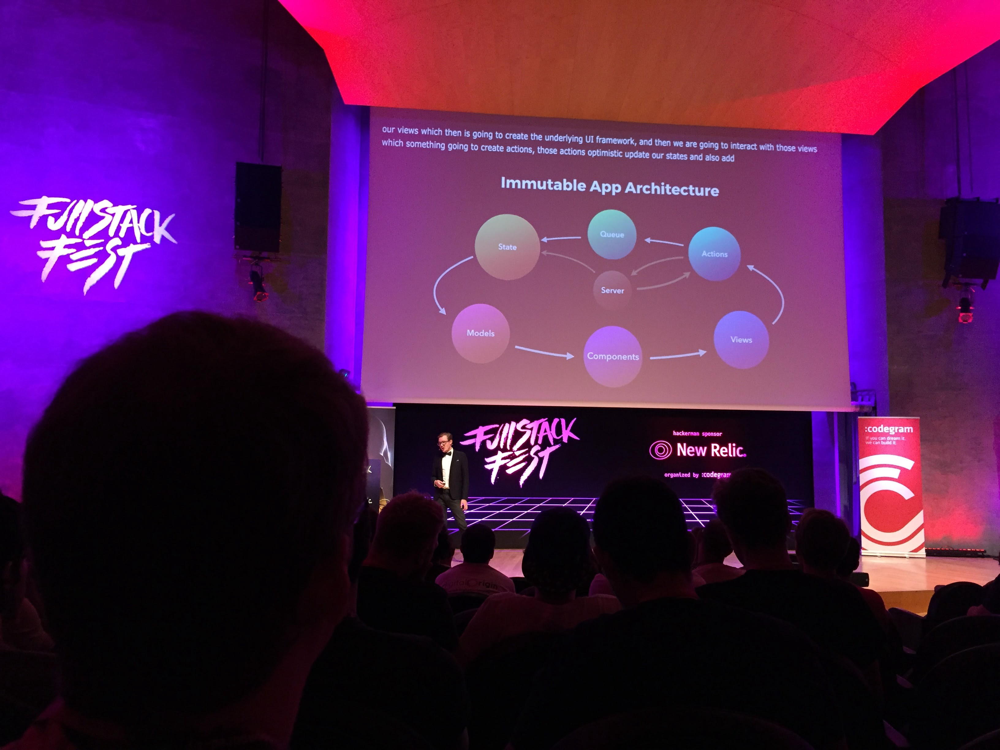

This article will deal with front-end architectural concepts. It is heavily based on [Lee Byron’s talk](https://www.youtube.com/watch?v=pLvrZPSzHxo) at Fullstack Fest 2016 in Barcelona about Immutable User Interfaces, but also on UI architecture I implemented at iAdvize.

***Edit nov 2019 :***
_Practices have evolved since this talk in 2016 and librairies have been created to bring those principles to life (Redux, React Hooks...). However they are still relevant and are now heavily used all all around the front-end community._

# MVC and Rest might not be the solution

Last decade, MVC and Rest reigned the software world. As the UI becomes increasingly like an installed app (see [The Front-end Is a Full-stack](https://www.youtube.com/watch?v=wtURpqTgtUs&list=PLe9psSNJBf76DOOKMkDpyo_A5PfZk7JWc&index=23), by [Luca Marchesini](https://twitter.com/xbill82)), data flux is slowly becoming a big bowl of spaghetti. Views and models are always listening to each other and updating to adapt, so there might be unforeseen cascading side effects, the data sate is not always up to date in the entire app and the most important issue you have to deal with is “where does that change come from ?”.

Another issue to consider is that even in 2016 you can’t rely on networks. Internet can be slow, you can get disconnected if you go underground… This is not been my main problematic recently, as my users are still desktop users, with a generally good internet connexion. But as a front-end developer, it must always be kept in mind, especially if you’re building a mobile app.

# Immutable data flux

Bringing immutability principles into the app gives garanties that the manipulated data won’t be modified by something you don’t know at the other side of the app. That is especially useful when you’re working on a large application, in a team of 10+ developers, where you can’t be aware of everything that’s happening at one point in time. By keeping a tight control on what’s changing, you can free your mind and focus on what really matters: your code!

# sVirtual views

Every kind of platform (web browsers, iOS, Android…) has views and the ability to create view trees. However, their APIs are not amazing so you always need to track the reference of your elements or fetch them in a mysterious way if you want to mutate them (cheers you lovely _document.getElementById ^^_), and no one will ever be able to know it has changed. Components were born to solve that problem. They are an additional level of abstraction on top of the views, defined as pure function which always return the same view for a given data state.

```js
Component(State) => View
```

A component library can create a virtual representation of the component tree and transform it into the view tree that will appear on the screen. When the input data changes, the virtual tree is re-rendered and the lib can make a diff between the actual representation and the new one to only re-paint elements that have moved.

We use React for our web components. For mobile developers, you can rely on ReactNative, ComponentKit…

```
Model --> Component --> View
```

# Explicit is better than implicit

Components and state are really closed to each other, as one is in charge of rendering the data stored by the other, so if during the development process the structure of one of them is changed (ie: add a new property in the view or remove one in the model…) everything in the app has to consider those changes. This might become very tricky when the app has dozens of components receiving the whole state without describing which property they use. Therefore, components have to explicitly say what kind of data they’ll need.

```js
// DONT
const myView = new Component(myState)

// DO
const myView = new Component({ myName, myPhoto })
```

React has PropTypes that can be deeply described, with object description, not-null options… handelling Javascript lack of real object typing.

# Actions to bring UI to life

For now this architecture is simple but it can’t be altered by user interactions. To handle this job, actions are coming.

```js
Action(State) => State
```

They are methods that take the current state as a parameter and return a new state. Thanks to services, this new state is then synchronized with backend.

Networks can be slow or encounter latency and your users have to be aware that their actions have been taken into account by the system. Two solutions appear. The first one is _loaders_, but they can quickly become very annoying, especially if loaders block user interactions to avoid concurrency actions.
The second one is _Optimistic State_: actions return a computed version of the old state based on what is supposed to be its new value, and a promise that will resolve the state server-side.

```js
Action(State) => {OptimisticState, Promise(State)}
```

Therefore, actions can be queued so there is no concurrency issue in the way data is processed.

```js
Action3(Action2(Action1(State)) => State
```

There are several ways to implement this kind of queue. At iAdvize, we rely on event dispatcher and javascript monothreading: events trigger actions and, as Javascript is not multithreaded we are sure they are processed in the right order.

<Image>



</Image>

Using this cycle app architecture has made our development process as a team easier, and improved our efficiency. We always know where changes come from. Also, as we based our development on pure functions, we are sure that nothing from the outside world will interfere in our function and it is easier to be tested.

This made the composition of different components all over the app way better.
Lee finished its talk by saying “Architecture is a Tradeoff”. This solution might not be the best for your usage, and it has to be challenged. Because of what building an app involves, we discovered new ways to constantly improve it. That’s why there is no finish line on the path of software engineering, forcing us to never stop exploring and innovating.
