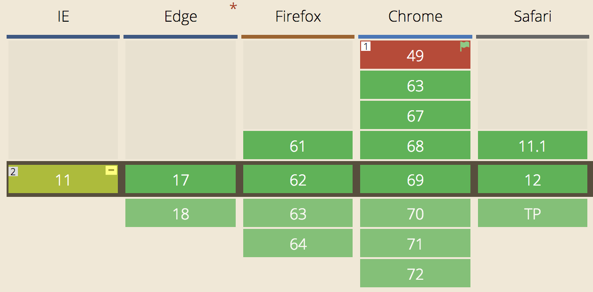
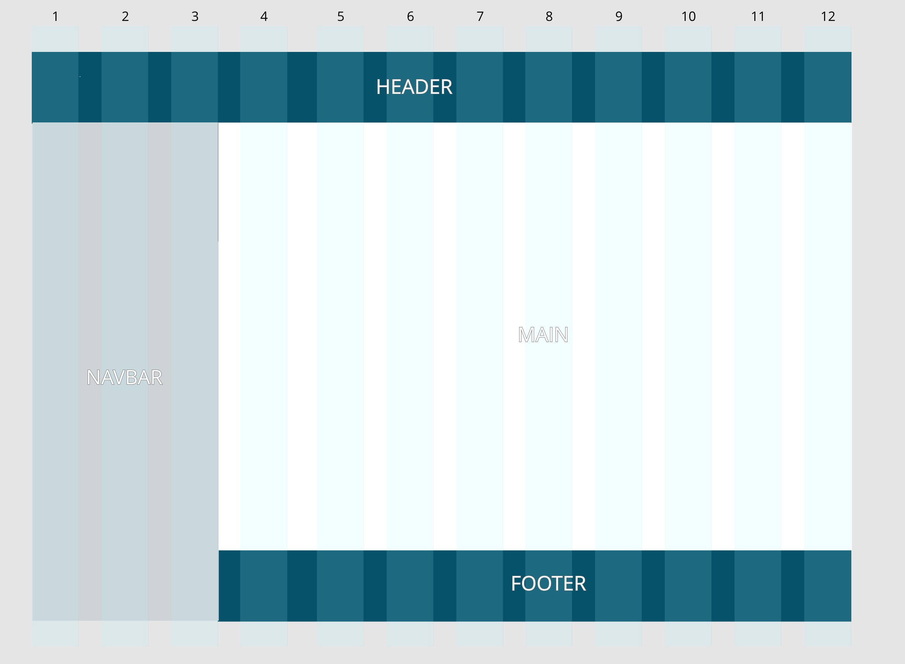

<Image align="left">


</Image>

As frontend developers, we care a lot about keeping a clear distinction between semantic content, which is handled by the HTML code, and the style of the web pages, handled by the CSS. We know a well-organized page will improve accessibility, SEO, and UX in general.

However, our designer friends and colleagues often try to improve the user experience by coming up with new innovative ways to present data and organize the web pages. I’m not revealing a big secret by admitting it can sometimes lead to some headaches as we need to juggle with HTML and CSS, searching for a balance between clean code and matching the design perfectly.

Grid Layout was created to define a template dividing the page into regions and define how relationships of its sub-parts are handled.

## Grid vs Flexbox

Flexbox came out a few years earlier and helped to make layouts simpler. It was made popular by famous CSS frameworks such as Bootstrap or Foundation and it is now widely used.

Flexbox is useful to set up a linear layout. It is a one dimension layout that can distribute elements automatically in a unique column.

Despite their similarities, Grid layout and Flexbox are not competing: Grid should be used to define a multi-column layout. It can be compared to the template used in the traditional print design. Thanks to grids, we are able to separate layout and style, container and content, where they used to be mixed.

## Compatible browsers.

Even if it’s still a W3C Candidate Recommendation, the Grid Layout has been implemented by all major web browsers by now: Firefox was the first in April 2017, followed by Chrome, Safari, and Opera. Edge waited until Octobre 2017 to implement it.

Internet Explorer 10 and 11 have a partial support of the Grid Layout as they implemented an older version of the specification, making it necessary to use prefixes for some features or an external tool such as [Autoprefixer](https://autoprefixer.github.io/).

According to [Caniuse.com](https://caniuse.com/#search=grid%20layout), more than 90% of the tracked browsers are now able to support the method.

<Image>



</Image>

## Example

A picture is worth a 1000 words, let’s play with the basic features by developing a simple blog layout. It is composed of 4 parts: a header, the main container, a lateral navigation bar, and a footer.

<Image>



</Image>

The HTML structure for this example will be very basic:

```html
<html>
  <head>
    <script>
       html, body {
         height: 100vh;
         width: 100vw;
         padding: 0;
         margin: 0;
         text-align: center;
       }
      header {
         background-color: #05526a;
      }
      nav {
         background-color: #ced4d6
      }
      main {
         background-color: #FFF;
      }
      footer {
         background-color: #05526a;
      }
    </script>
  </head>

  <body>
    <header>Header</header>
    <main>Main</main>
    <nav>Navbar</nav>
    <footer>Footer</footer>
  </body>
</html>
```

We’ll make the body a grid container by setting the _display_ property to _grid_. The body will have a block behavior (it can also be set to _inline-grid_ to be an inline grid container).

All direct children of the grid container are now grid items, and the blog parts are distributed all along the width and height of the container.

As we can see, the mock-up is based on a 12-column and 3-row template. We will use the grid-row-start/end and grid-column-start/end to dispatch the different parts of the blog in their respective rows and columns.

```css
    body {
       **display: grid;**
     }

    header {
       grid-column-start: 1;
       grid-column-end: 13;
     }
     nav {
       grid-column-start: 1;
       grid-column-end: 4;
       grid-row-start: 2;
       grid-row-end: 4;
     }
     main {
       grid-column-start: 4;
       grid-column-end: 13;
       grid-row-start: 2;
       grid-row-end: 3;
     }
     footer {
       grid-column-start: 4;
       grid-column-end: 13;
     }
```

Lines and columns numbers start from 1 to n+1.
Those 4 properties can be a positive or a negative integer. If negative, it counts in reverse, starting from the end edge of the explicit grid. In addition, **_span_** keyword can define the number of row/column we want our block to have instead of defining the start or end.

Shorthands also exist to reduce the number of lines in the CSS file:

```css
    header {
       grid-column: 1;
       grid-column-end: 13;
     }

    */* is the same as */*

    header {
       **grid-column: 1 / 13;**
     }

    */* ------------- */*

    nav {
       grid-row-start: 2;
       grid-row-end: 3;
       grid-column-start: 1;
       grid-column-end: 4;
     }

    */* is the same as */*

    nav {
       **grid-area: 2 / 1 / 3 / 4;
    ***/* grid-area: row-start / col-start / row-end / col-end; */*

    }
```

## Grid container

Now that we’ve set up the columns, we need to define the width and height of the different blocks. _grid-template-column/row_ will help us do that.

```css
.gridContainer {
  grid-template-columns: 60px 60px 60px 60px 60px 60px 60px 60px 60px 60px 60px 60px;
}
```

As it’s a cumbersome way to write the property, it can be simplified with the _repeat()_ function

```css
.gridContainer {
  grid-template-columns: * * repeat(12, 60px) * *;
  grid-template-rows: 90px auto 90px;
}
```

## Grid area

Each child element of the grid container is called a grid item.
They can be placed in the grid using grid-column, grid-row, and grid-area as we did previously.

Another way to arrange them in the layout is using the **_grid-template-area _**property. To do that, a good practice is to name each area of the grid

```css
header {
  grid-area: header;
}
nav {
  grid-area: nav;
}
main {
  grid-area: main;
}
footer {
  grid-area: footer;
}
```

Then, using the grid-template-area, it becomes possible to define how the areas are organized inside the container using their name and specify the number of column and row they occupy.

```css
grid-template-areas:
  ‘header header header header header header header header header header header header’
  ‘nav nav nav main main main main main main main main main’
  ‘nav nav nav footer footer footer footer footer footer footer footer footer’;
```

Unfortunately, I didn’t find a way to use the `repeat` function to simplify the property, resulting in something not really maintainable. Though, for this specific template, the power of a 12 column template is not used. That’s why the number of columns can be reduced and their width increased.

```css
.gridContainer {
  grid-template-columns: repeat(4, 240px);
  grid-template-rows: 90px auto 90px;
  grid-template-areas:
    ‘header header header header’
    ‘nav main main main’
    ‘nav footer footer footer’;
}
```

To increase readability, an idea can be to enforce that all areas are named with the same number of letter. Therefore it can create a visual link between the property of _grid-template-areas_, and the actual result on the screen.

```css
.gridContainer {
  grid-template-columns: repeat(4, 240px);
  grid-template-rows: 90px auto 90px;
  grid-template-areas:
    ‘head head head head’
    ‘navi main main main’
    ‘navi foot foot foot’;
}
```

## Responsive example

Using the grid template makes the responsive design easier. Indeed, thanks to media queries, it is possible to define different templates depending on the screen width and re-use the grid item’s name we have previously defined.

```css
@media only screen and (max-width: 599px) {
  .gridContainer {
    grid-template-columns: repeat(4, 1fr);
    grid-template-rows: 90px auto auto 90px;
    grid-template-areas:
      ‘header header header header’
      ‘main main main main’
      ‘nav nav nav nav’
      ‘footer footer footer footer’;
  }
}

@media only screen and (min-width: 600px) and (max-width: 900px) {
  .gridContainer {
    grid-template-columns: repeat(4, 1fr);
    grid-template-areas:
      ‘header header header header’
      ‘main main main main’
      ‘nav nav footer footer’;
  }
}
```

<Image caption="Responsive view of the template">


</Image>


## The Fr unit

The previous code sample shows a new unit that appeared with Grid Layout and has been used in the _grid-template-columns_: the Fr unit.

A Fr is a fractional unit that represents 1 part of the available space. Of course, fr unit can be mixed with other standard units

```css
grid-template-column: 40px 1fr 1fr 80px;
```

This sample means the first column is 40px, the last one is 80px. The remaining space in the center is then divided into 2 columns of the same width.

Here is the end of this quick tour of the new opportunities that the Grid Layout offers. Some other properties have not been mentioned, gaps, alignments, etc… many properties allow to organize the grid elements.

Below you’ll find the CodePen with the final code for the layout. Have fun playing around with CSS Grid Layout, and maybe it can be useful in your futur projects ?

<iframe height="350" style="width: 100%;" scrolling="no" title="CSS Grid Layout" src="https://codepen.io/jsoulet/embed/QZbOjV?height=265&theme-id=dark&default-tab=css,result" frameborder="no" allowtransparency="true" allowfullscreen="true">
  See the Pen <a href='https://codepen.io/jsoulet/pen/QZbOjV'>CSS Grid Layout</a> by Johan S.
  (<a href='https://codepen.io/jsoulet'>@jsoulet</a>) on <a href='https://codepen.io'>CodePen</a>.
</iframe>

## References

To dig deeper into CSS Grid Layout, here is a list of useful links:
- [Grid Garden](http://cssgridgarden.com/): learn and experiment Grid Layout through a small game
- [Start using CSS Grid Layout Today](https://www.youtube.com/watch?v=NoBbTAFQCxQ), a conference by Rachel Andrew at the DevFest 2017 in Nantes
- [Gridbugs](https://github.com/rachelandrew/gridbugs), a list of known bugs in the browser’s implementations
- [A Complete Guide to Grids](https://css-tricks.com/snippets/css/complete-guide-grid/), by CSS-Tricks
