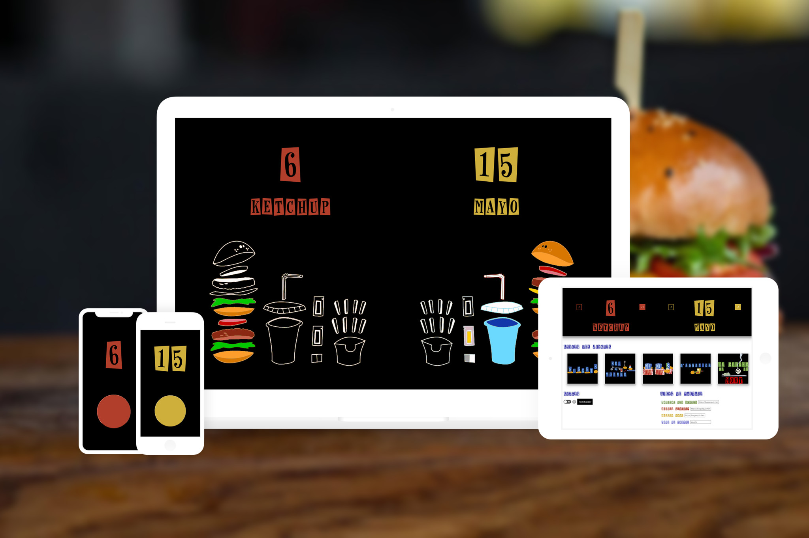

### Détails du projet

En 2018, le célèbre jeu d'Alain Chabat a fait un retour triomphant sur TMC et le jeu de société sorti dans la foulée promettait de recréer l'ambiance du plateau TV chez soi, en famille ou entre ami•e•s. Malheureusement il lui manquait toute l'interactivité qui fait son charme.

En guise de défi avec moi même et afin de pimenter les parties, j'ai recréé avec les technologies web les interactions entre les joueur•euse•s, le plaisir de voir son score augmenter en temps réel, les jingles de manches...

#### Les points clefs

- Dashboard du Grand Miam pour contrôler la partie
- Ecran des scores avec les jauges de points en forme de burgers
- Buzzers individuels
- Server temps réel basé sur Socket.io
- Frontend : ReactJS + SCSS
- Backend : Express + PostgreSQL
- Hébergé par Heroku

### Année
2018

### Screenshots

<Image>

</Image>
