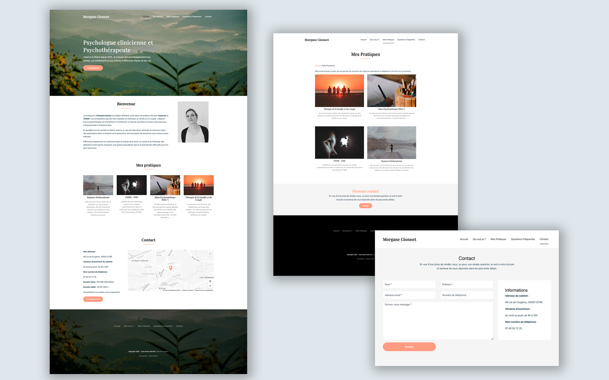

### Project details

Morgane Gionnet is an independant psycologist from Vitré (Brittany, France). She came to me to give a digital life to her practive. It is not obvious to contact a psycologist, that's why it was important to create a smooth univers for her patients and a simple user flow to answer their questions quickly.

Morgane also needed to be able to edit every content of her website without risking to break it. Tht's why the website I built was based on Contentful CMS as it offers a large variety of validation rules so editors can be protected. Front-end development was made using NextJS because this framework offers server-side rendering and other features out of the box, such as link prefetching, in order to create a fast and fluent navigation.

#### Highlights

- Server side rendered website with NextJS
- Integrate Contentful CMS
- Search engine optimization
- Hosted on Netlify

<Button href="https://morganegionnet.fr">Visit the website</Button>

### Year
2019

### Screenshots

<Image>

</Image>
